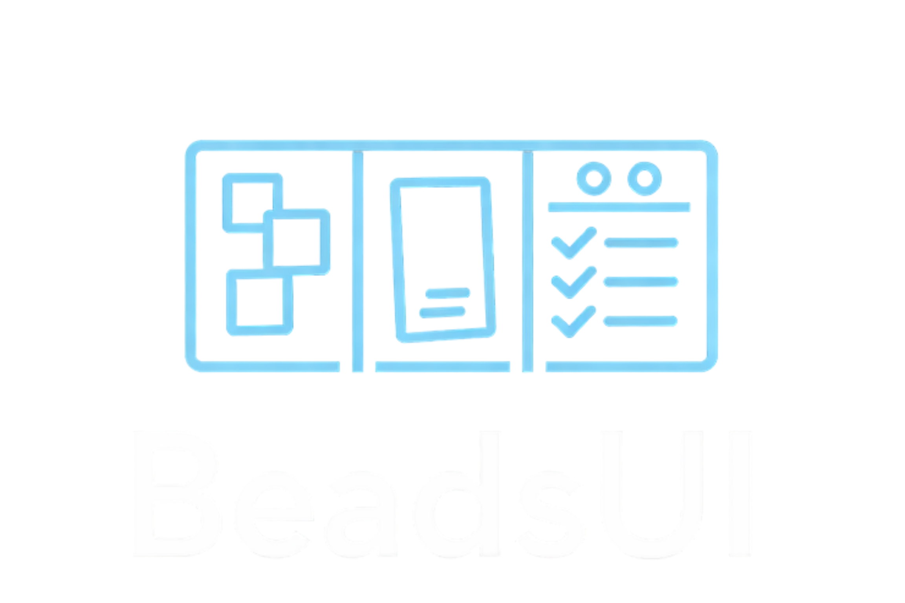

<p align="center">
  
</p>

<p align="center">A visual Kanban UI for <a href="https://github.com/steveyegge/beads">Beads CLI</a> — built with Next.js + Rust. Real-time sync, epic tracking, git ops and multi-project dashboard.</p>

> **Works great with [Beads Orchestration](https://github.com/AvivK5498/Claude-Code-Beads-Orchestration)** — A multi-agent orchestration framework for Claude Code that uses beads for git-native task tracking.

## See It in Action

**Dashboard** — All your projects in one place with status at a glance:


**Kanban Board** — Organize tasks across Open → In Progress → In Review → Closed:


**Bead Details** — Dive into epics with full context and subtasks:


## Key Features

- 📋 **Multi-project dashboard** — Manage all your beads projects in one place with status donut charts
- 🗂️ **Kanban board** — Open → In Progress → In Review → Closed with drag-to-update workflow
- 🏗️ **Epic support** — Group related tasks with visual progress bars, view all subtasks, close epic when complete
- 🔗 **Related tasks** — Bidirectional "see also" links between beads via `bd dep relate`, visible on cards, subtask rows, and detail panels
- 🧠 **Memory panel** — Browse, search, edit, and archive your project's knowledge base (`.beads/memory/knowledge.jsonl`) from a slide-out panel
- 🚀 **PR workflow** — Create PRs, view CI status, merge, and auto-close beads when PRs are merged — all from the Kanban board
- 🎨 **Type-based visuals** — Bugs, features, and epics display with distinct accent colors for quick recognition
- 🔄 **Real-time sync** — File watcher auto-updates when beads files change on disk; PR status refreshes every 30s
- 🔍 **Search & filter** — Unified floating toolbar with search, type filters (epics/tasks), today mode, status, and owner filters
- 🏷️ **Project tagging** — Organize with colored tags and filter by them
- ⚡ **Performance optimized** — Efficient polling skips closed beads to reduce unnecessary checks

## Quick Start

### Option 1: npm install (Recommended)

**Prerequisites:**
- Beads CLI: `brew install steveyegge/beads/bd`

**Install and run:**
```bash
npm install -g beads-kanban-ui
bead-kanban
```

That's it! The server starts automatically and opens your browser.

> On first run, the postinstall script downloads the platform binary (~15MB). This is one-time only.

### Option 2: Build from source

**Prerequisites:**
```bash
# Install beads CLI
brew install steveyegge/beads/bd

# You'll also need Node.js 18+ and Rust
```

**Install and run:**
```bash
git clone https://github.com/AvivK5498/beads-kanban-ui
cd beads-kanban-ui
npm install
npm run dev:full
```

Then navigate to **`http://localhost:3007`** and add your beads projects.

The app watches for file changes and syncs in real-time.

---

## How It Works

### Dashboard
1. Click **+ Add Project** and select a directory with a `.beads/` folder
2. See all projects with status donuts showing task distribution
3. Click any project to view its Kanban board

### Kanban Board
1. Tasks are organized by status: Open, In Progress, In Review, Closed
2. Drag cards between columns to update status
3. Click any task to see full details, comments, and related subtasks (for epics)

### Features in Detail

**Epic Management**
- Group related tasks under a single epic
- Visual progress bar shows completion percentage (e.g., "3/5 children done")
- Click "Close Epic" button when 100% of children are complete
- View all subtasks directly within the epic card
- Design documents automatically linked to epics

**PR Workflow Integration**
- Create pull requests directly from the Kanban board
- See real-time CI check status for each PR
- Merge code directly from the UI without leaving Beads
- Get immediate alerts if merge conflicts are detected
- Status updates automatically every 30 seconds

**Type-Based Visual Coding**
- Bug, feature, and epic tasks display with distinct accent colors
- Quickly identify task types at a glance without reading labels
- Consistent color scheme across dashboard and board views

**Memory Panel**
- Access your project's knowledge base from the unified toolbar (🧠 button)
- Browse learned insights and investigation findings captured during development
- Search and filter entries by type (Learned / Investigation)
- Edit content and tags inline, archive or delete entries
- Click any entry to navigate directly to its linked bead

**Related Tasks**
- Create bidirectional "see also" links between beads with `bd dep relate`
- Related task count shown on kanban cards alongside comment count
- Full "Related Tasks" section in the bead detail panel with clickable navigation
- Epic subtask rows show per-child related count badges

**Search & Filter**
- Unified floating toolbar consolidates all controls into a single pill bar
- Quick filters for status, priority, and assigned owner
- Type filter to show only epics or standalone tasks
- Today mode to surface recently updated items
- Project tags for organization

**Real-time Sync**
- The app watches `.beads/issues.jsonl` and updates automatically
- No refresh needed—changes appear instantly

**Git Integration**
- Each task shows its git branch status
- Useful for tracking which branch a task lives on
- Pull request metadata synced from GitHub/GitLab

**Performance Optimized**
- Polling intelligently skips closed beads to reduce load
- Worktree status checking only runs for active tasks
- PR status updates are batched to minimize API calls

---

## Detailed Setup

### Development Mode

Run both frontend and backend together:
```bash
npm run dev:full
```

Or run separately:
```bash
# Terminal 1: Frontend (http://localhost:3007)
npm run dev

# Terminal 2: Backend (http://localhost:3008)
npm run server:dev
```

The Rust backend builds automatically on first run. If you need to rebuild it:
```bash
cd server && cargo build --release && cd ..
```

### Production Build

For a single binary deployment:
```bash
npm run build
npm run server:build
./server/target/release/beads-server
```

The production server embeds the frontend and serves everything from a single binary on port 3008.

---

## Related Projects

- **[Beads CLI](https://github.com/steveyegge/beads)** — Git-native issue tracker (the core tool this UI wraps)
- **[Beads Orchestration](https://github.com/AvivK5498/Claude-Code-Beads-Orchestration)** — Multi-agent orchestration framework for Claude Code using beads

---

## License

MIT
